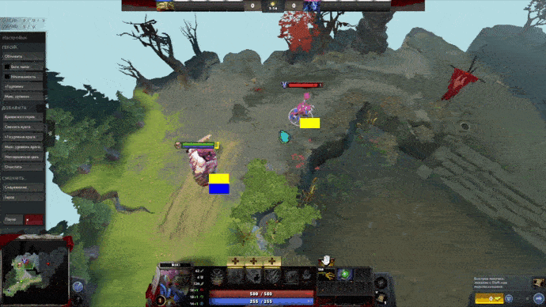
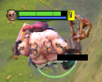
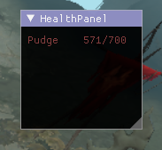
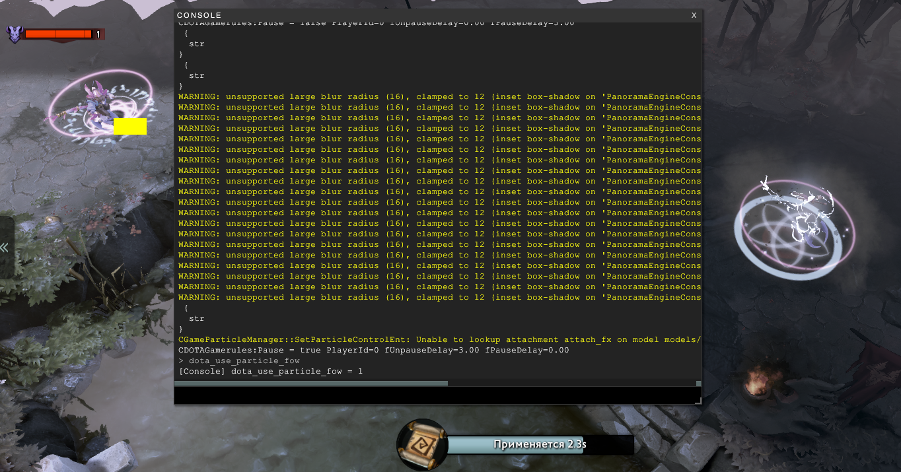

Dota 2 windows cheat

Visible by enemy (local player)
Is under truesight effect (like sentry, gem)

Blue quad -- sentry affected  
Yellow quad -- spotted by enemy  
Black brick -- marked true hero  
  

  

Console Variable hack: allows you to change protected CVars
example: __dota_use_particle_fow 0 force__
will cause you to see enemy spells and teleports in Fog Of War
however, dota engine will still think it is '1' and will show it
dont belive it feature is not working. It will set value that checks
so either hack working either your game crashed :D
__for now working only for CVars that check int32 value and only with decimal arguments.__
(number one means you can not see through fog of war. Do you see? So feature means you can now :P)
 

__INSTRUCTION__! 
hack variables after you joined server.  As i understand, dota does not reset value after every match, but if dota see protected value changed, client will fix to.  
To avoid it, you should connect to match (NOT LOBBY THAT ALLOWS YOU TO CHEAT), and after that type sv_cheats 1 or dota_use_particle_fow 0 or whatever you want.  This way checked and works fine.
